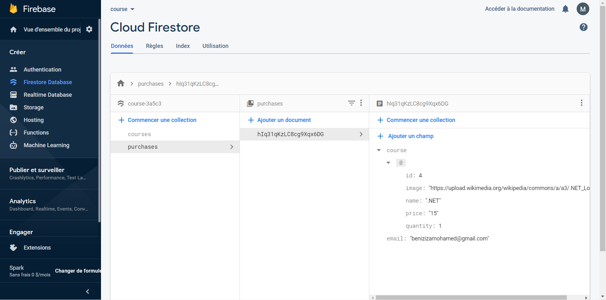
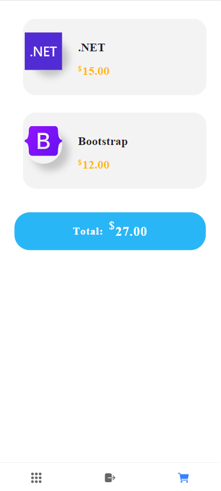

# CODING

> You Want to learn about web programming this is your best app.


This application helps you learn programming languages and programs for the web, by subscribing to the suggested lessons

## Table of Contents

- [CODING](#coding)
  - [Table of Contents](#table-of-contents)
  - [Getting Started](#getting-started)
  - [Components](#components)
  - [Services](#services)
  - [Project Map](#project-map)
  - [Firebase](#firebase)
  - [Elements](#elements)
      - [Sign In](#sign-in)
      - [Sign Up](#sign-up)
      - [Menu](#menu)
      - [Listing](#listing)
      - [Details](#details)
      - [Card item](#card-item)
  - [Demo](#demo)
  - [Version](#version)

## Getting Started

- [Download the installer](https://nodejs.org/) for Node Js.
- Install the ionic CLI globally: `npm install -g ionic`
- Clone this repository: `git clone https://github.com/Benziza/CODING.git`.
- Run `npm install` from the project root.
- Run `npm install firebase @angular/fire --save` from the project root.
- Run `ionic serve` in a terminal from the project root.

## Components

- badge
- button
- cart-item
- course-card

## Services

- auth-client.service
- authentication-service
- cart.service
- course.service
- formation-service

## Project Map

The following figure is the map for this project.

```
- src/
  - app/                      … This folder has all your application parts
    -components/              … Contains the components that will be used in the other components
        + badge/                     … Contains the badge component that will contain the duration of our training
        + button/                    … Contains the button component that will used in almost in all the project
        + cart-item/                 … Contains the cart-item component that will used in cart component
        + course-card/               … Contains the course-card component that will used in listing component
    -home/                    … Contains the component that will be used to use the application,by sign-in or sign-up
        + sign-in/                   … Contains the sign-in component that will contain the sign-in forms
        + sign-up/                   … Contains the sign-up component that will contain the sign-up forms
    +menu/                    … The parent component of screens,we use tab to switch between components
    -models/                  … this folder contain the model of our objects (cart-item+course+user)
        - cart-item.module.ts       … contain the model of cart-item
        - course.module.ts          … contain the model of course
        - user.ts                   … contain the model of user
    -screens/
        + cart                … Contain component of cart that contain what the user buy
        + detail              … Contain component of detail of a course
        + listing             … Contain component of all course in firebase
    -services/
        - auth-client.service.ts              … Contain the function getAuth()
        - authentication-service.ts           … Contain all function of sign-in and sign-up (send verificatin to email)
        - cart.service.ts                     … Contain all function related to buy a course like : total amount + remove a course + add to cart + getCart + getName to add in firebase
        - course.service.ts                   … Contain getCourse() to get detail of a course
        - formation-service.ts                … Contain getFormationList() to get all formation list
+ assets/                                       This folder is added STATIC fixed folders, such as images, and other fonts
- environments/                               … Some settings are added, such as database settings (in our situtation firebase)
    -environment.prod.ts                      … In the development phase
    -environment.ts                           … In the production phase
-theme/
```

## Firebase




## Elements

---

#### Sign In

You can log in by entering your email and password, and then it will be confirmed whether it is in the database (firebase) or not


#### Sign Up

You can log in by entering your email and password, and then a message will be sent to your email to confirm, and then you can go to Log In to enter


#### Menu

This is the main interface where it appears by default listing interface and gives you the right to exit the application or go to the shopping cart


#### Listing

All existing lessons appear with their prices. Clicking on one of the lessons will direct you to 'Details interface'


#### Details

More details about each lesson appear, for example, the number of study days, the prerequisite required, a mini-explanation of the lessons and the price, and finally there is a button to add to the shopping cart


#### Card item

It shows you your purchases and the total price, where you have the right to delete one of the lessons,and finally to enrol them



## Demo


## Version

This project use the following technologies.

| Technologie Name | Version |
| :--------------- | :-----: |
| ionic            | 6.18.2  |
| angular          | 13.1.3  |
| npm              | 16.13.2 |
| firebase         | 10.4.2  |
