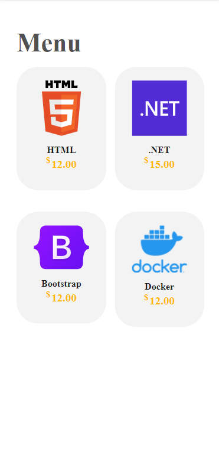

# CODING

> You Want to learn about web programming this is your best app.

This application helps you learn programming languages and programs for the web, by subscribing to the suggested lessons

## Table of Contents

- [CODING](#coding)
  - [Table of Contents](#table-of-contents)
  - [Getting Started](#getting-started)
  - [Components](#components)
  - [Services](#services)
  - [Elements](#elements)
      - [Sign In](#sign-in)
      - [Sign Up](#sign-up)
      - [Menu](#menu)
      - [Listing](#listing)
      - [Details](#details)
      - [Card item](#card-item)
  - [Demo](#demo)
  - [Version](#version)
  <!-- - [Deploying](#deploying)
  - [Progressive Web App](#progressive-web-app)
  - [Android](#android)
  - [iOS](#ios) -->

## Getting Started

- [Download the installer](https://nodejs.org/) for Node Js.
- Install the ionic CLI globally: `npm install -g ionic`
- Clone this repository: `git clone https://github.com/Benziza/CODING.git`.
- Run `npm install` from the project root.
- Run `npm install firebase @angular/fire --save` from the project root.
- Run `ionic serve` in a terminal from the project root.

## Components

- badge
- button
- cart-item
- course-card

## Services

- auth-client.service
- authentication-service
- cart.service
- course.service
- formation-service

## Elements

---

#### Sign In

You can log in by entering your email and password, and then it will be confirmed whether it is in the database (firebase) or not

#### Sign Up

You can log in by entering your email and password, and then a message will be sent to your email to confirm, and then you can go to Log In to enter

#### Menu

This is the main interface where it appears by default listing interface and gives you the right to exit the application or go to the shopping cart

#### Listing

All existing lessons appear with their prices. Clicking on one of the lessons will direct you to 'Details interface'

#### Details

More details about each lesson appear, for example, the number of study days, the prerequisite required, a mini-explanation of the lessons and the price, and finally there is a button to add to the shopping cart

#### Card item

It shows you your purchases and the total price, where you have the right to delete one of the lessons,and finally to enrol them

## Demo

## Version
